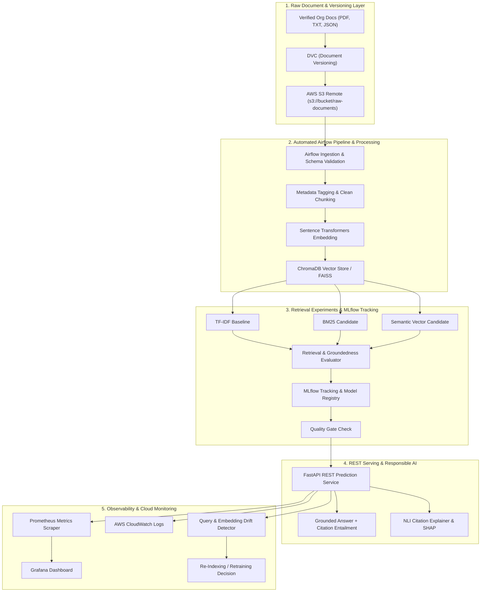
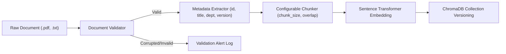
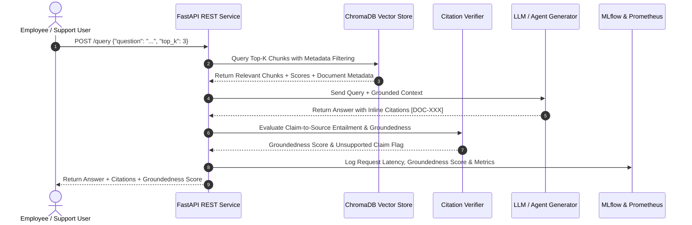
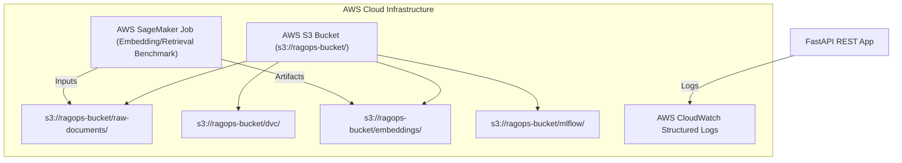

# RAGOps: Monitored Enterprise Knowledge Assistant Architecture

## 1. Overview
The **RAGOps: Monitored Enterprise Knowledge Assistant** is an end-to-end, production-oriented system built to answer employee and technical support questions using **only verified organizational documents**. It combines document version control (DVC), vector indexing (ChromaDB), automated pipeline orchestration (Apache Airflow), experiment tracking (MLflow), REST serving (FastAPI), CI/CD automation (GitHub Actions), observability (Prometheus + Grafana), Responsible AI auditing (SHAP + NLI Citation Entailment), and AWS Cloud integration (S3, SageMaker, CloudWatch).

---

## 2. End-to-End System Architecture Diagram

---

## 3. Document Processing & Ingestion Pipeline

---

## 4. RAG Retrieval & Citation Generation Architecture

---

## 5. AWS Cloud Architecture

---

## 6. Key Component Specifications
- **Raw Document Layer**: `data/raw/` versioned with DVC.
- **Vector Storage**: ChromaDB persistent local/S3 indexed collection.
- **Retrieval Baseline vs Candidates**: TF-IDF (Baseline), BM25 (Candidate 1), SentenceTransformer `all-MiniLM-L6-v2` (Candidate 2).
- **Prompt Versioning**: Standardized under `prompts/` (`system_v1.txt`, `answer_v1.txt`, `fallback_v1.txt`).
- **Unanswerable Questions Policy**: System checks grounding score and explicitly responds: *"I could not find sufficient information in the verified organizational documents."*
- **Monitoring & Observability**: Prometheus scraping `rag_*` metrics, Grafana visual dashboards, and KS-test query distribution drift detection.
